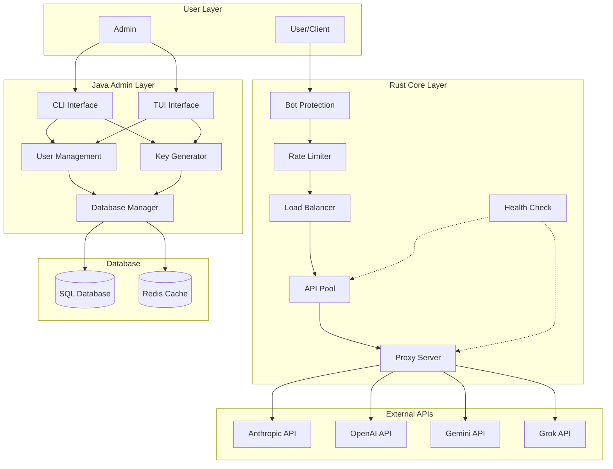
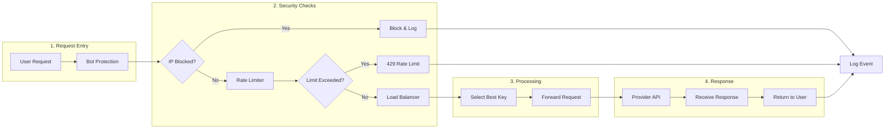
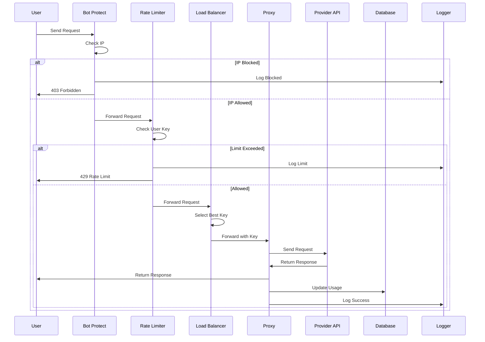
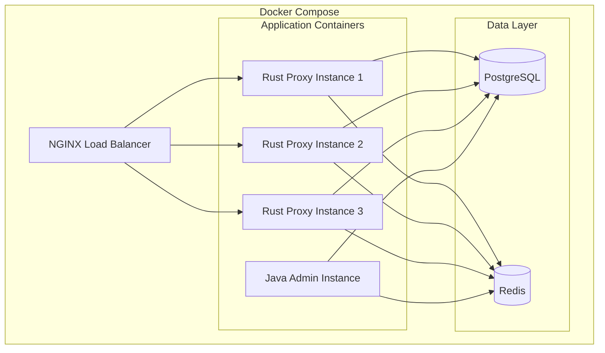

## README.md

```markdown
# API Pooling System

A high-performance API Keys management system for resellers, using **Rust** for the proxy core and **Java** for the admin CLI/TUI.

## Purpose

- Manage API keys from multiple providers (Anthropic, OpenAI, Gemini, Grok)
- Pool keys to distribute load and avoid rate limits
- Create keys for users (admin creates them)
- Protect the system from bots and attacks
- Provide CLI/TUI for admins

---

## Architecture Overview

### System architecture

```
┌─────────────────────────────────────────────────────────────────────────────┐
│                              API Pooling System                            │
├─────────────────────────────────────────────────────────────────────────────┤
│                                                                             │
│  ┌─────────────────────┐    ┌──────────────────────────────────────────┐   │
│  │   Java Admin Layer  │    │         Rust Core Layer                 │   │
│  │                     │    │                                          │   │
│  │  • CLI / TUI        │◄──►│  • Proxy Server (Reverse Proxy)        │   │
│  │  • User Management  │    │  • Load Balancer (Round Robin/Weighted) │   │
│  │  • Key Generation   │    │  • Rate Limiter                        │   │
│  │  • Dashboard        │    │  • Bot Protection                      │   │
│  │  • System Info      │    │  • API Pooling Logic                   │   │
│  └─────────────────────┘    └──────────────────────────────────────────┘   │
│              │                              │                               │
│              ▼                              ▼                               │
│  ┌─────────────────────┐    ┌──────────────────────────────────────────┐   │
│  │   Database Layer    │    │         External APIs                   │   │
│  │                     │    │                                          │   │
│  │  • Users            │    │  • Anthropic API                        │   │
│  │  • API Keys         │    │  • OpenAI API                           │   │
│  │  • Logs             │    │  • Gemini API                           │   │
│  │  • Config           │    │  • Grok API                             │   │
│  └─────────────────────┘    └──────────────────────────────────────────┘   │
│                                                                             │
└─────────────────────────────────────────────────────────────────────────────┘
```

---

## Components

### 1. **Rust Core Layer** (High-Performance Proxy)

| Component | Description |
|-----------|-------------|
| **Proxy Server** | Reverse Proxy receives requests from Users and forwards them to the Provider |
| **Load Balancer** | Selects the best API Key (Round Robin, Weighted, Least Connections) |
| **Rate Limiter** | Controls the number of requests per Key/User/IP |
| **Bot Protection** | Blocks IPs that send too many requests |
| **Health Check** | Checks the health of API Keys and the Provider |
| **Failover** | Automatically switches to another Key when a Key fails |

### 2. **Java Admin Layer** (Management & CLI/TUI)

| Component | Description |
|-----------|-------------|
| **CLI (Command Line)** | Commands for Admin (login, add key, list users, etc.) |
| **TUI (Text UI)** | Interactive interface for managing the system |
| **User Management** | Manages users (create, delete, set Tier) |
| **Key Generation** | Admin creates Keys for Users |
| **Dashboard** | Displays system status (Keys, Requests, Health) |
| **System Info** | Displays system information (Base URL, Status, Version) |
|
---

## Data Flow

### Proposal flow (Request Flow)

```
User Request
     │
     ▼
┌─────────────────────────────────────────────────────────────────┐
│  Rust Proxy Server                                             │
│                                                                 │
│  1. Bot Protect ──► Check IP (Blocked/Allowed)                │
│                     │                                          │
│                     ▼                                          │
│  2. Rate Limiter ──► Check User Key (Limit/Remaining)         │
│                     │                                          │
│                     ▼                                          │
│  3. Load Balancer ─► Select Best API Key                      │
│                     │                                          │
│                     ▼                                          │
│  4. Send Request ──► Forward to Provider API                  │
│                     │                                          │
│                     ▼                                          │
│  5. Handle Response ─► Return to User                         │
│                                                                 │
└─────────────────────────────────────────────────────────────────┘
     │
     ▼
Provider API (Anthropic/OpenAI/Gemini/Grok)
     │
     ▼
Response Return to User
```

---

## Project Structure

```
api-pooling-system/
├── README.md
├── Cargo.toml                    # Rust dependencies
├── pom.xml                       # Java dependencies (Maven)
│
├── rust-core/                    # Rust Core Layer
│   ├── src/
│   │   ├── main.rs               # Entry point
│   │   ├── proxy.rs              # Proxy Server
│   │   ├── load_balancer.rs      # Load Balancer
│   │   ├── rate_limiter.rs       # Rate Limiter
│   │   ├── bot_protect.rs        # Bot Protection
│   │   ├── health.rs             # Health Check
│   │   ├── config.rs             # Configuration
│   │   └── lib.rs                # JNI Bindings
│   ├── Cargo.toml
│   └── rust-core.jar             # Compiled JNI Library
│
├── java-admin/                   # Java Admin Layer
│   ├── src/
│   │   ├── main/
│   │   │   ├── java/
│   │   │   │   ├── com/api/pool/
│   │   │   │   │   ├── Main.java           # Entry point
│   │   │   │   │   ├── cli/
│   │   │   │   │   │   ├── CLIHandler.java # Command handler
│   │   │   │   │   │   └── Commands.java   # Command definitions
│   │   │   │   │   ├── tui/
│   │   │   │   │   │   ├── TUIMain.java    # TUI entry
│   │   │   │   │   │   └── screens/        # TUI screens
│   │   │   │   │   ├── auth/
│   │   │   │   │   │   ├── AuthManager.java
│   │   │   │   │   │   └── TokenManager.java
│   │   │   │   │   ├── db/
│   │   │   │   │   │   └── DatabaseManager.java
│   │   │   │   │   └── config/
│   │   │   │   │       └── ConfigManager.java
│   │   │   └── resources/
│   │   │       └── config.json
│   │   └── test/
│   └── pom.xml
│
├── database/                     # Database
│   ├── schema.sql
│   └── data.json
│
└── docs/
    ├── architecture.md
    └── api.md
```

---

## 🔧 Prerequisites

| Tool | Version | Purpose |
|------|---------|---------|
| **Rust** | 1.70+ | Core Proxy Development |
| **Java** | 17+ | Admin CLI/TUI Development |
| **Maven** | 3.8+ | Java Build Tool |
| **Cargo** | Latest | Rust Build Tool |
| **Docker** | Latest | Containerization (Optional) |

---

## Installation

### 1. Clone Repository
```bash
git clone https://github.com/yourusername/api-pooling-system.git
cd pkay-tui
```

### 2. Build Rust Core
```bash
cd rust-core
cargo build --release
# Generate JNI Library
cargo build --release --target x86_64-unknown-linux-gnu
cp target/release/librust_core.so ../java-admin/src/main/resources/
```

### 3. Build Java Admin
```bash
cd ../java-admin
mvn clean package
```

### 4. Run System
```bash
# Start Rust Proxy Server
./rust-core/target/release/proxy-server --config config.json

# Start Java Admin CLI
java -jar target/api-pool-admin.jar --cli

# Start Java TUI
java -jar target/api-pool-admin.jar --tui
```

---

## Commands (CLI)

| Command | Description |
|---------|-------------|
| `login --username <user> --password <pass>` | Login as Admin |
| `add-provider --name <name> --url <url>` | Add Provider |
| `add-model --provider <name> --model <model>` | Add Model to Provider |
| `add-key --provider <name> --key <api-key>` | Add API Key |
| `generate-key --user <user_id> --tier <tier>` | Generate Key for User |
| `list-keys` | List all User Keys |
| `revoke-key --key <key>` | Revoke User Key |
| `system-info` | Show System Information |
| `dashboard` | Show Dashboard |
| `logout` | Logout |

---

## Database Schema

```sql
-- Users Table
CREATE TABLE users (
    id VARCHAR(36) PRIMARY KEY,
    username VARCHAR(50) UNIQUE NOT NULL,
    password_hash VARCHAR(255) NOT NULL,
    email VARCHAR(100),
    tier VARCHAR(20) DEFAULT 'default',
    created_at TIMESTAMP DEFAULT CURRENT_TIMESTAMP,
    updated_at TIMESTAMP DEFAULT CURRENT_TIMESTAMP
);

-- User Keys Table
CREATE TABLE user_keys (
    id VARCHAR(36) PRIMARY KEY,
    user_id VARCHAR(36) NOT NULL,
    key VARCHAR(255) UNIQUE NOT NULL,
    tier VARCHAR(20) DEFAULT 'default',
    status VARCHAR(20) DEFAULT 'active',
    limit INT DEFAULT 60,
    used INT DEFAULT 0,
    created_at TIMESTAMP DEFAULT CURRENT_TIMESTAMP,
    expires_at TIMESTAMP,
    FOREIGN KEY (user_id) REFERENCES users(id)
);

-- Provider Keys Table
CREATE TABLE provider_keys (
    id VARCHAR(36) PRIMARY KEY,
    provider VARCHAR(50) NOT NULL,
    key VARCHAR(255) UNIQUE NOT NULL,
    model VARCHAR(50),
    status VARCHAR(20) DEFAULT 'active',
    used INT DEFAULT 0,
    failed INT DEFAULT 0,
    created_at TIMESTAMP DEFAULT CURRENT_TIMESTAMP
);

-- Providers Table
CREATE TABLE providers (
    id VARCHAR(36) PRIMARY KEY,
    name VARCHAR(50) UNIQUE NOT NULL,
    base_url VARCHAR(255) NOT NULL,
    status VARCHAR(20) DEFAULT 'active',
    health INT DEFAULT 100,
    created_at TIMESTAMP DEFAULT CURRENT_TIMESTAMP
);

-- Logs Table
CREATE TABLE logs (
    id VARCHAR(36) PRIMARY KEY,
    type VARCHAR(20) NOT NULL,
    message TEXT NOT NULL,
    ip VARCHAR(45),
    user_id VARCHAR(36),
    created_at TIMESTAMP DEFAULT CURRENT_TIMESTAMP
);
```

---

## Security Considerations

| Security Measure | Description |
|------------------|-------------|
| **Authentication** | Admin Login with Password + Token |
| **Token Expiry** | Admin Tokens expire after 7 days |
| **Key Expiry** | User Keys expire after 30 days |
| **Rate Limiting** | Prevent Abuse |
| **Bot Protection** | Block Suspicious IPs |
| **Encryption** | API Keys Encrypted in Database |
| **Audit Logs** | Track All Actions |

---

## Performance Metrics

| Metric | Target | Description |
|--------|--------|-------------|
| **Throughput** | 500,000+ RPS | Requests per second |
| **Latency** | < 2ms | Average response time |
| **Availability** | 99.9% | System uptime |
| **Concurrency** | 10,000+ | Concurrent users |
| **Memory Usage** | < 100MB | Core memory footprint |

---

## License

MIT License - Free for educational and research purposes. Commercial use requires permission.

---

## Author

**السلطان ريان** - [Your GitHub Profile](https://github.com/yourusername)

---

## References

- [Rust Documentation](https://doc.rust-lang.org/)
- [Java Documentation](https://docs.oracle.com/en/java/)
- [Anthropic API](https://docs.anthropic.com/)
- [OpenAI API](https://platform.openai.com/docs/)
```

---

## Architecture Diagram (Mermaid)

### 1. System Architecture Diagram



### 2. Request Flow Diagram



### 3. Component Interaction Diagram



### 4. Deployment Architecture



---

## Summary of Requirements

| Feature | Status | Implementation |
|---------|--------|----------------|
| **Rate Limit** | ✅ | Rust Core - Rate Limiter |
| **API Pooling** | ✅ | Rust Core - Load Balancer |
| **Provider Base URL + Key** | ✅ | Rust Core - Provider Management |
| **Model Add** | ✅ | Rust Core - Provider Management |
| **Admin Key Generation** | ✅ | Java Admin - Key Generator |
| **User Keys (Auto Generated)** | ✅ | Java Admin - Key Generator |
| **System Info** | ✅ | Java Admin - System Info |
| **Bot Protection** | ✅ | Rust Core - Bot Protect |
| **Admin Auth** | ✅ | Java Admin - Auth Manager |
| **CLI/TUI** | ✅ | Java Admin - CLI/TUI |

---

## Current Implementation (this repository)

The system described above is implemented in this repository. See `docs/architecture.md` for design details and `docs/api.md` for the full API/CLI reference.

**Stack:** Rust core (`rust-core/`, axum + reqwest + rusqlite/SQLite) · Java admin (`java-admin/`, JDK 17 + Maven, sqlite-jdbc + Gson) · shared SQLite database (`database/db.sqlite`, schema in `database/schema.sql`).

**Build & run** (run from the project root):

```bash
# Rust proxy core
cd rust-core && cargo build --release

# Java admin layer (produces java-admin/target/api-pool-admin.jar)
cd ../java-admin && mvn clean package

# Start the proxy
./rust-core/target/release/proxy-server --config config.json

# Admin CLI / TUI (in another terminal)
java -jar java-admin/target/api-pool-admin.jar --cli
java -jar java-admin/target/api-pool-admin.jar --tui
```

**First-time setup** (the default admin `admin`/`admin` is created from `config.json` on first run):

```bash
java -jar java-admin/target/api-pool-admin.jar login --username admin --password admin
java -jar java-admin/target/api-pool-admin.jar add-provider --name openai --url https://api.openai.com
java -jar java-admin/target/api-pool-admin.jar add-key --provider openai --key sk-...
java -jar java-admin/target/api-pool-admin.jar add-user --username alice --password secret
java -jar java-admin/target/api-pool-admin.jar generate-key --user alice --tier premium
```

**Notes / deviations from the spec:**
- `database/schema.sql` uses `max_limit` instead of `limit` (reserved word) and adds a `models` table for the `add-model` command.
- The runtime database is SQLite (README diagrams also mention Postgres/Redis; those are deployment options, not implemented).
- A mock provider server for local testing ships in `scripts/mock_server.py`.
- Java/Maven are not bundled with the repo — install JDK 17+ and Maven 3.8+ to build the admin layer.

---

